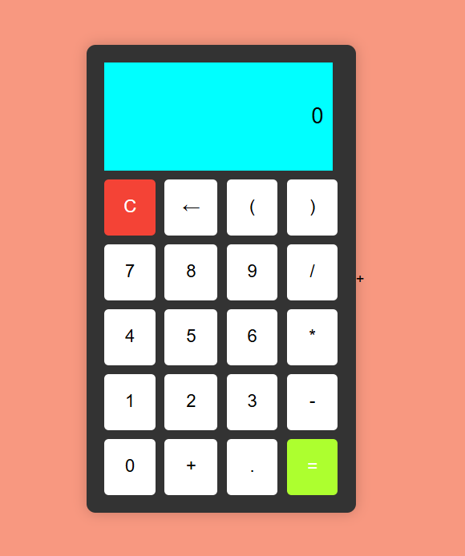

# JavaScript Calculator

A simple web-based calculator to perform basic arithmetic operations (addition, subtraction, multiplication, and division).  
Built with JavaScript for the logic, HTML for the structure, and CSS for a clean design.

## Screenshot

